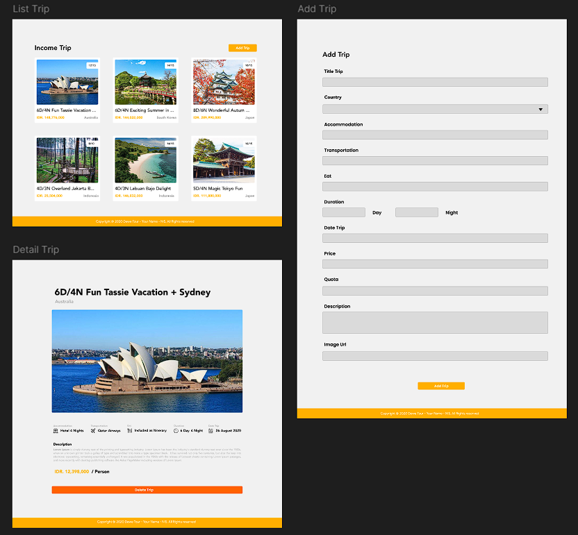

# Dewe Tour - Fullstack Beginner Level

## Setup Project

1. Clone repository ini

```bash
git clone <repository-url>
```

2. Setelah clone akan terlihat 2 folder yaitu frontend dan backend. Silahkan mulai dari salah satu folder tersebut dan baca README.md untuk petunjuk instalasi

## Tugas

Buatlah aplikasi website end-to-end sesuai dengan desain yang telah disediakan di atas. Pastikan:

- Frontend dibuat sesuai desain.
- Backend dibuat untuk memenuhi kebutuhan data aplikasi.

> **Maksimal waktu pengerjaan adalah 7 hari (termasuk frontend dan backend).**

### Yang Perlu Dilakukan

1. Buat API sederhana untuk mengelola data trip yang akan digunakan di frontend.
2. Tampilkan daftar trip berdasarkan data dari API yang telah dibuat.
3. Buat halaman berikut:
   - Landing Page
   - Detail Page
   - Add-Trip Page
   - (Opsional) Edit Page – akan menjadi nilai plus.

### Hasil Akhir yang Diharapkan

Link design:
https://www.figma.com/design/MUnpNJ6cWe9eaU9J0MCQY2/Dewe-Tour?node-id=0-1&p=f&t=8HqKoCrncqAFNR5O-0


### Penilaian

- ✅ 30% - Berhasil membuat website sesuai desain.
- ✅ 30% – Berhasil menambahkan trip.
- ✅ 30% – Berhasil menghapus trip.
- ➕ 10% (nilai plus) – Berhasil menambahkan fitur edit trip.

## Note

Kamu boleh gunakan library apapun yang tidak disediakan pada inisiasi project.
